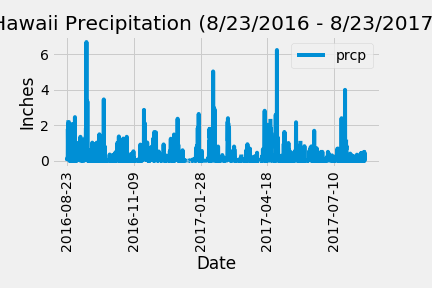
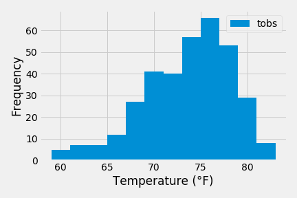

# sqlalchemy-challenge

### Accessing Code

- SQLAlchemy was used to perform a weather analysis (Precipitation and Temperature Observation Data). This can be found in the climate_starter.ipynb jupyter notebook, here:[climate_starter](climate_starter.ipynb)

- Flask was used to create routes for the Hawaii weather API. API SQLite Connection & Landing Page, Static Routes, and Dynamic routes can be found here:
[app.py](app.py)

- Below are the 2 plots generated in the jupyter notebook:

 

